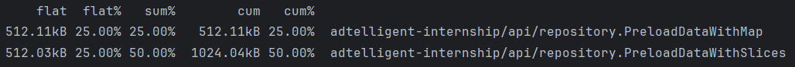
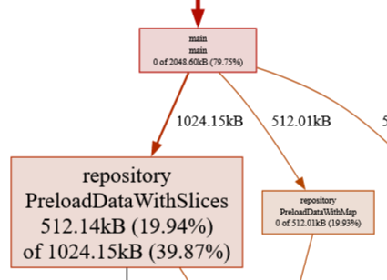
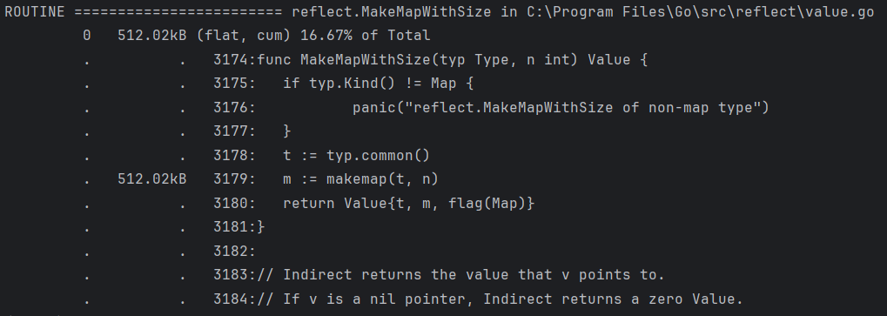
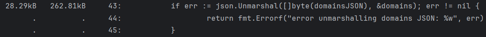
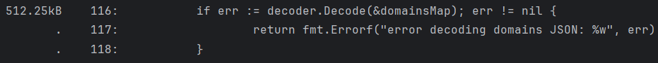

# Adtelligent Internship

> **Performed by:** Eugeniu Popa

## Run the application

Before running the application, make sure [Docker](https://www.docker.com/) is installed.  
Type these commands in the root folder.

```bash
docker compose up
```

```bash
go run .  
```

## Endpoints:

- Get data:

  ```
  GET "http://localhost:8080/campaigns?source_id=1&domain=gmail.com"
  ```

## Benchmarks:
Result without cache:
```
  BenchmarkCampaignHandler-16          	     358	   3293453 ns/op	         2.352 response_time_ms
```

Result with cache:
```
  BenchmarkCachedCampaignHandler-16    	 1000000	      1037 ns/op	         0 response_time_ms
```

## Profiling

The profiling was done on cache preloading functions. Also, there are two different endpoints for different caches.

After several attempts, it seems that preloading data using maps is more memory efficient than using slices.

  

Graph visualization

 

There is also an observation that method `reflect.MakeMapWithSize` is called when preloading data.

 

It seems that it is more likely called when creating the dynamic map, but it also consumes memory to reallocate size.

Specifying the initial cache size "`var PreloadedCache = make(map[int][]Campaign, 100)`" would be a good way to make it more memory efficient.

A lot of memory is also consumed by unmarshalling the domains JSON. 

 

There was an attempt to optimize it by using decoding for a more streaming fashion, but in this case it gives the same result, or even worse sometimes.

 

The guess is that decoding should be used for bigger payloads that cannon be comfortably loaded into memory.

For the next time, there should be made profiles for the filtering logic.
